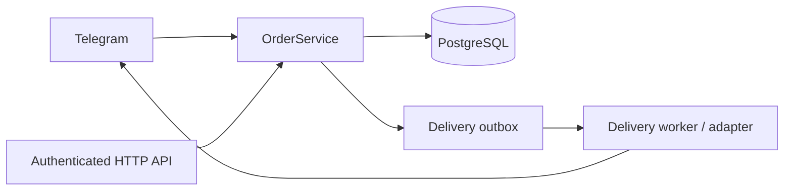
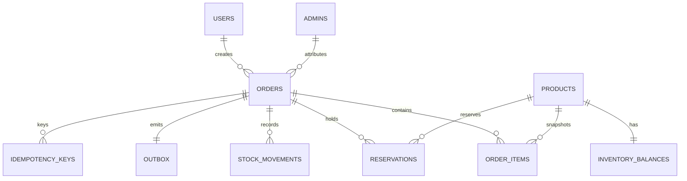

# OnlineShop backend

OnlineShop is a Python 3.11+ backend for a small Telegram and HTTP order workflow. It keeps the existing Persian Telegram customer experience while adding a PostgreSQL backed catalog, multi item orders, inventory reservations, authenticated operations API, and durable delivery outbox. The repository is designed to be readable as a portfolio project: transaction boundaries, privacy rules, migration history, and operational evidence are visible in source and tests.

## Quick start

The API uses PostgreSQL and Alembic. Docker Compose is the portable quick start; a local PostgreSQL installation also works when its client tools are on `PATH`.

```powershell
Copy-Item .env.example .env
# Set POSTGRES_PASSWORD and JWT_SECRET in .env or in your shell; do not commit .env.
docker compose up --build
```

For disposable integration data, point the test URL at a local database ending in `_test`:

```powershell
$env:DATABASE_URL = "postgresql+asyncpg://<user>:<password>@localhost:<port>/<database>"
$env:TEST_DATABASE_URL = $env:DATABASE_URL
$env:JWT_SECRET = "<local-secret>"
python -m pip install -r requirements.txt -r requirements-dev.txt -c requirements-lock.txt
python -m alembic upgrade head
python -m scripts.seed_synthetic --reset
python -m uvicorn backend.api.app:app --host 127.0.0.1 --port 8000
```

The seed command is restricted to `localhost` and the named `*_test` databases. It creates two users, two admins, and three products. Never place real customer records or Telegram credentials in this dataset.

## Architecture

FastAPI (`backend/api`) authenticates requests and maps role permissions to shared order, fulfillment, report, payment, and delivery services (`backend/services`). SQLAlchemy models and Alembic migrations define PostgreSQL state. Order creation computes totals from catalog prices, locks products in SKU order, reserves stock, snapshots invoice lines, records idempotency, and inserts an outbox row in one transaction. Fulfillment transitions are audited in the same transaction and revenue reports aggregate paid, non cancelled, non expired orders. The delivery worker claims outbox rows with leases and bounded retries, while the fake payment callback verifies signed raw bytes and deduplicates provider events.





## API examples

Get a token with a seeded account:

```powershell
$token = (Invoke-RestMethod http://127.0.0.1:8000/api/v1/auth/token -Method Post -Body @{username="portfolio-seller"; password="portfolio-test-password"}).access_token
$headers = @{Authorization = "Bearer $token"; "X-Request-ID" = "demo-request-001"}
Invoke-RestMethod http://127.0.0.1:8000/api/v1/products -Headers $headers
```

Create a catalog order. The server calculates the total and reserves stock; clients send no total.

```powershell
Invoke-RestMethod http://127.0.0.1:8000/api/v1/commerce/orders -Method Post -Headers $headers -ContentType 'application/json' -Body (@{
  customer_name='Synthetic Customer'; phone_raw='09120009999'; province='Tehran'; city='Tehran'; address='Synthetic Street'
  items=@(@{sku='DEMO-RED'; quantity=1}); idempotency_key='demo-order-001'
} | ConvertTo-Json)
```

`GET /health/live` checks process liveness. `GET /health/ready` runs a database query and includes pool state. `GET /metrics` exposes bounded in process HTTP counters plus delivery backlog count, oldest pending age, retry count, and pool state. Logs are JSON metadata containing request and order IDs, method, route, status, and latency. Request bodies, authorization headers, tokens, phone numbers, addresses, and payment bodies are never logged.

Warehouse and manager users can inspect and transition fulfillment through `GET/PATCH /api/v1/orders/{public_id}/fulfillment`; owners and managers can query `/api/v1/reports/revenue` or download its CSV form. Both surfaces use bounded inputs and role checks.

The local payment sandbox is `POST /api/v1/payments/fake/callback`. Sign the exact request bytes with the HMAC protocol in [`docs/fake-payment-and-worker.md`](docs/fake-payment-and-worker.md); duplicate event delivery is idempotent and mismatched amount, currency, signature, or transaction binding is rejected. The delivery worker is runnable with an injected transport using `python -m backend.delivery_worker --transport module:function`; transport failures are persisted for bounded retry or explicit reconciliation.

## Guarantees and security boundaries

Orders, item snapshots, reservations, idempotency records, stock movements, and outbox insertion commit or roll back together. Duplicate idempotency keys replay the original order only when their canonical payload matches; a different payload conflicts. Inventory reservations lock all products in deterministic order and enforce non negative database constraints. Seller responses omit customer PII and manager/warehouse access follows the route permission matrix in [`docs/api/permissions.md`](docs/api/permissions.md). Currency is explicit integer IRR in the current catalog flow.

Backups contain personal data and must be access controlled. The backup and restore scripts accept only local databases ending in `_test`; restore additionally requires a target ending in `_restore_test`. PostgreSQL tools resolve from optional `PG_BIN` and then `PATH`. See [`docs/backup-restore.md`](docs/backup-restore.md).

## Demo and evidence

Run the deterministic five minute walkthrough in [`docs/demo.md`](docs/demo.md). It covers authentication, API order creation, a final stock race, a real delivery worker failure/retry, signed fake payment, webhook replay, fulfillment, and revenue reporting.

The benchmark is intentionally modest and reproducible. Start the API with the synthetic seed, then run:

```powershell
python scripts/benchmark.py --base-url http://127.0.0.1:8000 --requests 100 --concurrency 4 > docs\benchmark-2026-09-07.json
```

The committed artifact [`docs/benchmark-2026-09-07.json`](docs/benchmark-2026-09-07.json) records the actual machine/runtime, dataset, request mix, concurrency, duration, p50/p95, throughput, errors, and query-count limitation from that run. It is a local baseline, not a production capacity claim.

## Verification

With PostgreSQL running and both dedicated databases migrated:

```powershell
python -m alembic check
python -B -m unittest discover -v
python -m unittest tests.integration.test_restore tests.integration.test_demo_smoke -v
ruff check order_bot backend tests scripts migrations
mypy order_bot backend
python -m pip check
```

The PostgreSQL integration tests refuse non local databases and names that do not end in `_test`; restore uses `RESTORE_DATABASE_URL` when supplied or derives a separate `_restore_test` target. Set `TEST_DATABASE_URL` to a disposable local `_test` database before running the integration suite.

## Decisions and limitations

The concise architecture decisions are [`docs/adr/001-shared-backend.md`](docs/adr/001-shared-backend.md), [`docs/adr/002-transactions-and-delivery.md`](docs/adr/002-transactions-and-delivery.md), and [`docs/adr/003-operational-evidence.md`](docs/adr/003-operational-evidence.md). Real charges, refunds, production deployment, multi store tenancy, and a broker are outside this slice. The payment and delivery integrations are deterministic local boundaries: the payment gateway is fake and signed, and the worker transport is injected so tests and demos never contact a real provider.
